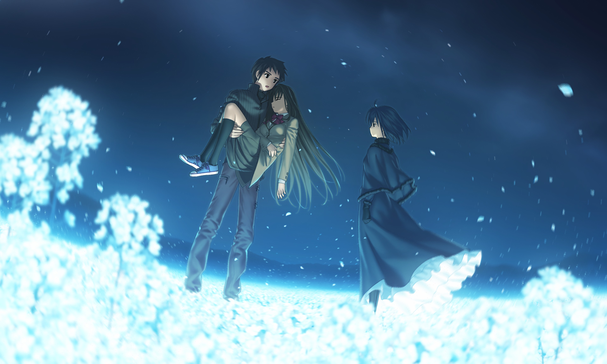

***The first at the beginning changed everything.***

***The second that followed acknowledged countless possibilities.***

***The third, building upon the previous, revealed the future.***

***The fourth, arising thereafter, concealed their presence.***

***The fifth, which marked the end, had long-lost its meaning.***

<em>---------------Witch on the Holy Night</em>

## Hi there! ❤️❤️

**Above is my favorite galgame, *Witch on the Holy Night*. Hopefully, you can also enjoy it.**

Nice to meet you guys. 😊😊

There is nothing that makes me happier than becoming a member of GitHub. As a newbie in programming, I hope everyone can be understanding and forgiving of the mistakes I make in programming. I will work hard to improve myself .The next time I update this homepage, I will be a pupil in programming.😏

<table>
    <tr>
        <td>
            
        </td>
        <td rowspan="2" align="center">
            
        </td>
    </tr>    
    <tr align="center">
        <td>
            <a href="http://slenderman23.3vhost.club/"><strong>My Home Page</strong></a>
        </td>        
    </tr>
</table>

