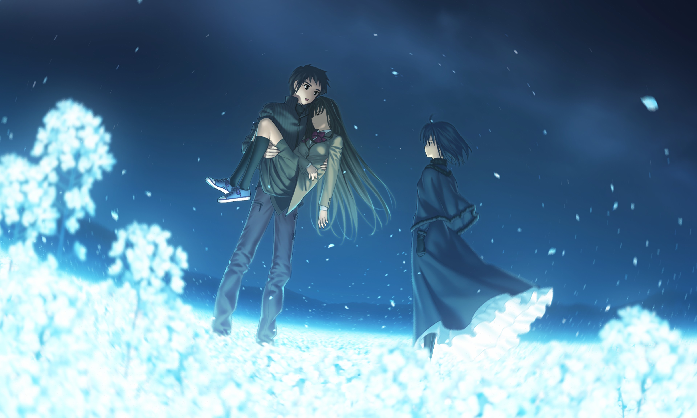

***At the beginning, the First changed all.***

***Next, the Second reconized many.***

***In answer, the Third showed the future.***

***Tethered, the Fourth concealed itself.***

***And the final Fifth had long since lost its significance.***

<em>---------------Witch on the Holy Night</em>

## Hi there! ❤️❤️

**Above is my favorite game, *Witch on the Holy Night*. Hopefully, you can also enjoy it.**

Nice to meet you guys. 😊😊

There is nothing that makes me happier than becoming a member of GitHub. As a newbie in programming, I hope everyone can be understanding and forgiving of the mistakes I make in programming. I will work hard to improve myself .The next time I update this homepage, I will be a pupil in programming.😏

<table>
    <tr>
        <td>
            
        </td>
        <td rowspan="2" align="center">
            
        </td>
    </tr>    
</table>

